<!-- PROJECT LOGO -->
 

  

  

  

  

<!-- TABLE OF CONTENTS -->

  
Table of Contents

  <ol>
    <li>
      <a href="#Introduction">Introduction</a>
      <ul>
        <li><a href="#What Are Game Pillars?">What Are Game Pillars?</a></li>
      </ul>
    </li>
    <li>
      <a href="#Game Pillar Types">Game Pillar Types</a>
    </li>
    <li><a href="#Game Pillar Examples in Industry">Game Pillar Examples in Industry</a></li>
    <li><a href="#Good Game Pillars">Good Game Pillars</a></li>
    <li><a href="#Bad Game Pillars">Bad Game Pillars</a></li>
    <li><a href="#Game Pillars for Your Project">Game Pillars for Your Project</a></li>
    <li><a href="#Summary">Summary</a></li>
    <li><a href="#References">References</a></li>
  </ol>

<!-- CONTACT -->
## Lecture Information

Slides Presentation with Media: [Link](https://docs.google.com/presentation/d/1KGYc0Du5xmiiQnFxYBg2Zi05I5WyUEsoRJjs1ZFF4WI/edit?usp=sharing)

By: Rylan James Graham - [Portfolio](https://rylanjgraham.com)

Project Link: [https://github.com/RylanJGraham/RPG-Game-Design](https://github.com/RylanJGraham/RPG-Game-Design)

CITM UPC Bachelors Student: [UPC CITM](https://www.citm.upc.edu/esp/estudis/grau-multimedia/utm_source=5745_multi&utm_medium=cpc&utm_campaign=multi_grau_esp&gclid=Cj0KCQiArsefBhCbARIsAP98hXT3ORoNB4hguls4CuEXaGSo6JDTlwTmVAv4ncjZ5ZNy8Wc95GxO_jMaAiZjEALw_wcB)

(<a href="#readme-top">back to top</a>)

<!-- ABOUT THE PROJECT -->
## Introduction

My name is Rylan Graham and I am a second year bachelors student in the Universitat Politecnica de Catalunya. This website is built for information regarding a lecture I delivered about RPG Game Design, or more specifically, the crucial Game Pillars for development. 

(<a href="#readme-top">back to top</a>)

### What Are Game Pillars?

“What I mean by this term is think about the 3 – 5 main elements/emotions your game is trying to explore and make the players feel” - Max Pears. [Source](https://www.gamedeveloper.com/design/design-pillars-the-core-of-your-game)

**Game Pillars in Essence**

*A game pillar is a fundamental concept that your game will utilize to function

*Game pillars can vary from mechanics, aesthetics, story, and technology Source

*Game pillars should relate to one another, and should not just be stand alone concepts. 

*Aim for 3-8 concepts for game pillars, however only 3 are essential. 

(<a href="#readme-top">back to top</a>)

<!-- GETTING STARTED -->
## Game Pillar Types

**Common RPG Game Pillars**
- [x] Market Systems

*Market Systems are a form of transaction or trading within the game. Players can trade in-game elements with one another and there is a value system*

- [x] Inventory 

*Players can store items that they collect throughout the game. Players inventories are customizable and personalized.*

- [ ] Visuals

*Players can become fully immersed through impressive or realistic visuals. This can also be through abstract art styles or musical elements.*

- [x] Exploration

*Players can roam the map, and exercise free will on where they move. This adds a level of immersion.*

- [ ] Unique Mechanics

*Some titles feature unique mechanics in regards to physics, combat, movement, and more. These are most popular nowadays as most typical concepts have been exhausted.* 

- [x] Competetive Elements

*Players can fight one another, computer ai, or other in-game elements. 

**RPG Pillar Reliance**

To be a good RPG there is often a reliance on these three pillars existing (even in a small manner) together in harmony. These are all good starting points for our own RPG’s, only we need to specify. 

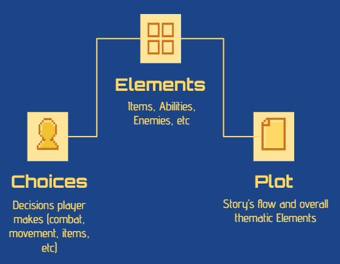

*Choices: Decisions player makes (combat, movement, items, etc)*

*Elements: Items, Abilities, Enemies, etc*

*Plot: Story’s flow and overall thematic Elements*

## Game Pillar Industry Examples

### Pokemon

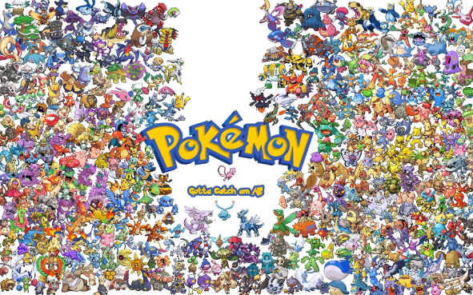

Pokemon is a game franchise founded by Nintendo, Game Freak, and Creatures. It was created by Satoshi Tajiri in 1996. The franchise is one of the best selling RPG titles of all time, beginning as Pokemon Red & Blue, and since evolving to include several other titles spanning various consoles, Tv series, Movies, Trading Cards, Apps, & more. However, what Game Pillars make Pokemon such a successful title? The video below seeks to explore that. 

**Video Below:**

**Game Pillar #1: Choice**

Pokemon allows their users to choose among several elements, whether it be their pokemon, exploration area, items etc. The player feels as though the gaming experience is truly customized to them, thus allowing them to add their personality into the game. This is an essential phenomena for a Game Pillar to provide: self-expression. 

**Game Pillar #2: Combat**

Pokemon allows their players to compete with in-game AI, whether it be Pokemon, trainers, or fellow players online. Players can enjoy competition and comparison with others. This is an essential factor, as we as human beings are based on comparison and competition, from a primative standpoint.  

### Final Fantasy Series

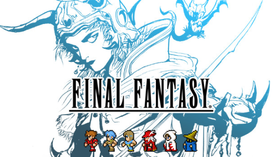

**Game Pillar #1: Visuals**

Final Fantasy has visually stunning visuals as of late. Although less game-oriented or technical, this could be described as a Game Pillar as it adds to the players immersion within the game. Game Pillars are unique elements that keep the player involved, and a visually stunning world to explore is certainly a draw. 

**Game Pillar #2: Combat**

Final Fantasy has a turn-based combat system, a perfect model for RPG's. Players can partake in combat with unique movesets, items, and weaponry. Players are allowed to be creative in their move selection choices, and to be mentally challenged in the challenge, two crucial features of a succesful game pillar. 

**Game Pillar #3: Story**

Final Fantasy has an immersive story that players can dive into. Spanning multiple titles, with hundreds of characters, players can investigate and develop characters story lines. This adds a level of immersion that is essential for Game Pillars. Players are able to establish emotional connections, impacting them even after the game has been exited. 

**Video Below:**

(<a href="#readme-top">back to top</a>)

## Good Game Pillars

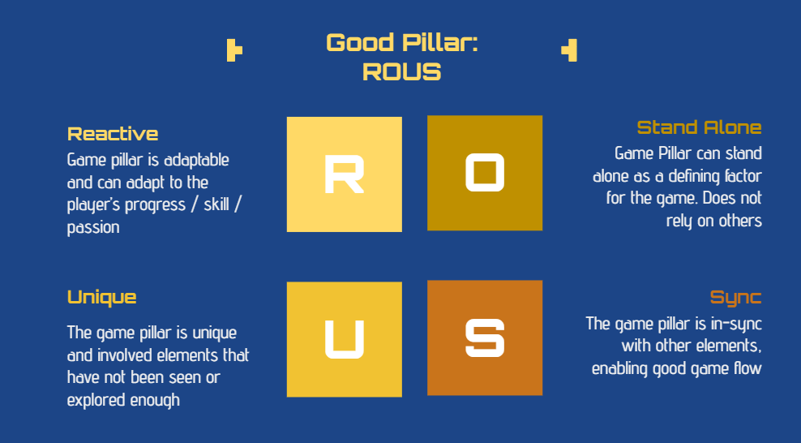

**Reactive**

*Game pillar is adaptable and can adapt to the player’s progress / skill / passion*

**Unique**

*The game pillar is unique and involved elements that have not been seen or explored enough*

**Stand Alone**

*Game Pillar can stand alone as a defining factor for the game. Does not rely on others*

**Synced**

*The game pillar is in-sync with other elements, enabling good game flow*

(<a href="#readme-top">back to top</a>)

## Bad Game Pillars

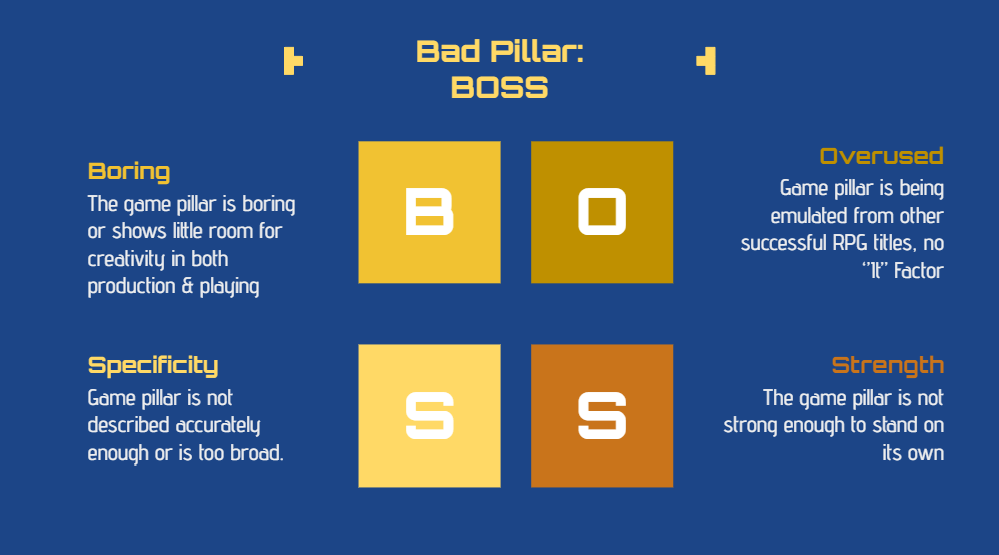

**Boring**

*The game pillar is boring or shows little room for creativity in both production & playing*

**Lack of Specificity**

*Game pillar is not described accurately enough or is too broad.*

**Overused**

*Game pillar is being emulated from other successful RPG titles, no ‘’It’’ Factor*

**Strength**

*The game pillar is not strong enough to stand on its own*

(<a href="#readme-top">back to top</a>)

<!-- CONTRIBUTING -->
## Your RPG

**How can we harness the capabilities of Game Pillars to our advantage?**

“When you don’t have any creative direction, or even worse, if your team does not agree on a single concept or direction, it becomes a mess. Everyone just starts making stuff on their own and following their own direction.” -Antoine Sarrazin [Source](https://ch0m5.github.io/Game-Design-Pillars/)

***Steps to Follow for Our RPG Pillars***

**Step 1. 3 Stages of Agreeance**

In order to begin the process of selecting game pillars for the RPG title, team members must complete these three requirements before moving onto further steps.

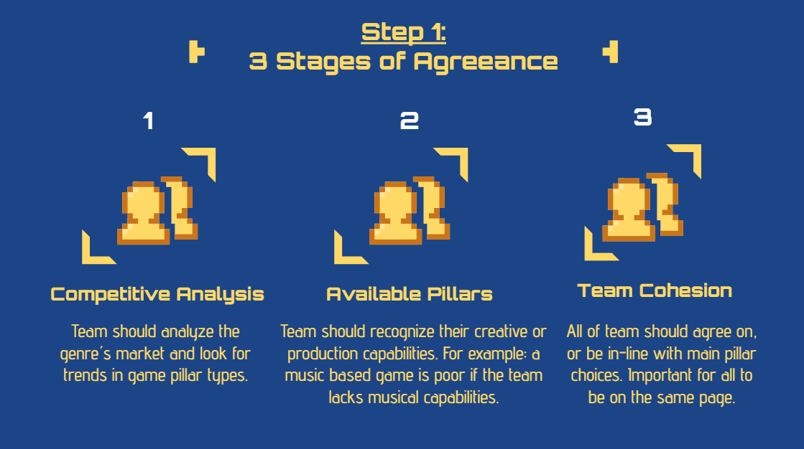

1. Competitive Analysis

*Team should analyze the genre´s market and look for trends in game pillar types.*

2. Available Pillars

*Team should recognize their creative or production capabilities. For example: a music based game is poor if the team lacks musical capabilities. *

3. Team Cohesion

*All of team should agree on, or be in-line with main pillar choices. Important for all to be on the same page.*

Once these requirements have been met, its time to move onto the next step. 

-
-

**Step 2. Audience Recognition & Catering**

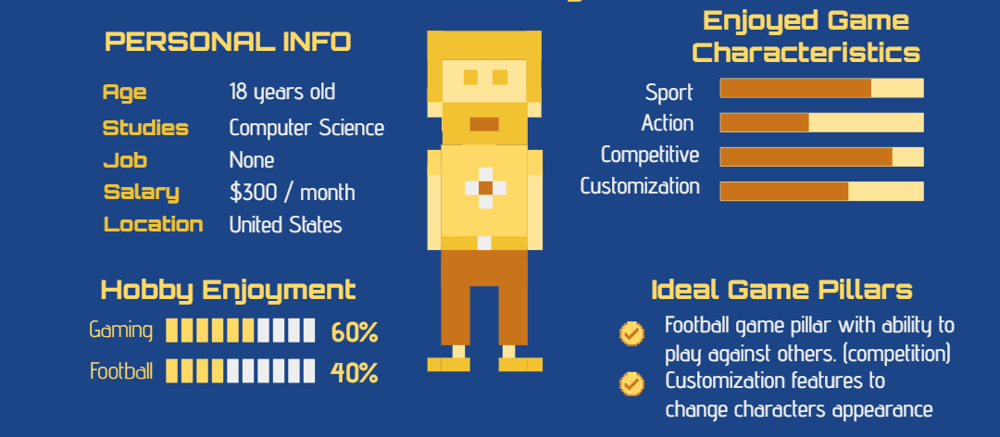

Recognizing your target audience is essential for understanding the required game pillars. The target audience can give an indication to required pillars based on their characteristics. Example being a sports lover may be more lenient towards competetive game pillars, or customization elements. Additionally the age can indicate societal trends in interest.  

-
-

**Step 3. Ensuring Fun Game Pillars**

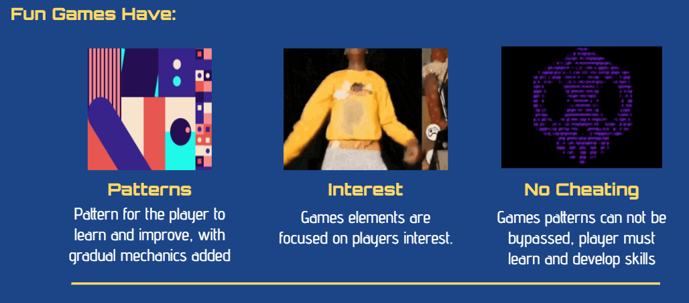

Fun games have: 

- Patterns: Pattern for the player to learn and improve, with gradual mechanics added
- Interest: Games elements are focused on players interest.
- No Cheating: Games patterns can not be bypassed, player must learn and develop skills

*Raf Costa's: A Theory of Fun*

In his book Costa outlines the essentials for having a fun and addictive game. These are inherent things in human psychology that cause them to become interested and addicted. These range from concepts such as human need for competition, human necessity for mastering patterns, and more. Below are some examples of these characteristics and possibilities for Game Pillars: 

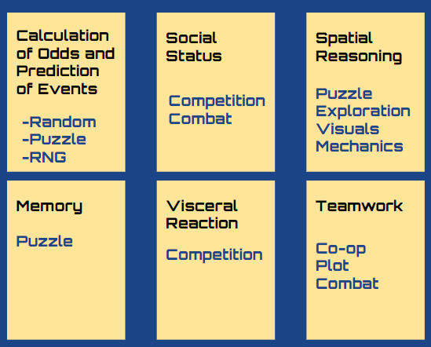

-
-

**Step 4. Game Elements & Pillar Relevancy**

Game elements (Items, Abilities, etc) must fit into the games theme and work with the set genre. For RPG’s this is quite simple as items are often collected, and fights and progression are solved by different type characteristics. If a Pillar is Combat it must not stray away from Exploration Pillar, etc. Below is a video describing this:

-
-

**Step 5. Guiding and Freeing the Player**

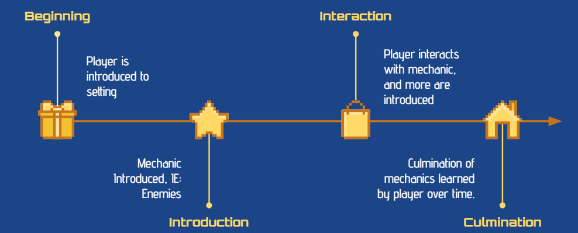

*How The Professionals Do It:*

**How Your Project Flow Should Be**

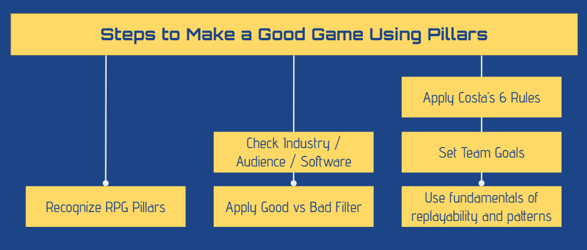

(<a href="#readme-top">back to top</a>)

<!-- LICENSE -->
## References

Distributed under the MIT License. See `LICENSE.txt` for more information.

(<a href="#readme-top">back to top</a>)

<!-- ACKNOWLEDGMENTS -->
## Acknowledgments

Use this space to list resources you find helpful and would like to give credit to. I've included a few of my favorites to kick things off!

* [Choose an Open Source License](https://choosealicense.com)
* [GitHub Emoji Cheat Sheet](https://www.webpagefx.com/tools/emoji-cheat-sheet)
* [Malven's Flexbox Cheatsheet](https://flexbox.malven.co/)
* [Malven's Grid Cheatsheet](https://grid.malven.co/)
* [Img Shields](https://shields.io)
* [GitHub Pages](https://pages.github.com)
* [Font Awesome](https://fontawesome.com)
* [React Icons](https://react-icons.github.io/react-icons/search)

(<a href="#readme-top">back to top</a>)

<!-- MARKDOWN LINKS & IMAGES -->
<!-- https://www.markdownguide.org/basic-syntax/#reference-style-links -->
[contributors-shield]: https://img.shields.io/github/contributors/othneildrew/Best-README-Template.svg?style=for-the-badge
[contributors-url]: https://github.com/othneildrew/Best-README-Template/graphs/contributors
[forks-shield]: https://img.shields.io/github/forks/othneildrew/Best-README-Template.svg?style=for-the-badge
[forks-url]: https://github.com/othneildrew/Best-README-Template/network/members
[stars-shield]: https://img.shields.io/github/stars/othneildrew/Best-README-Template.svg?style=for-the-badge
[stars-url]: https://github.com/othneildrew/Best-README-Template/stargazers
[issues-shield]: https://img.shields.io/github/issues/othneildrew/Best-README-Template.svg?style=for-the-badge
[issues-url]: https://github.com/othneildrew/Best-README-Template/issues
[license-shield]: https://img.shields.io/github/license/othneildrew/Best-README-Template.svg?style=for-the-badge
[license-url]: https://github.com/othneildrew/Best-README-Template/blob/master/LICENSE.txt
[linkedin-shield]: https://img.shields.io/badge/-LinkedIn-black.svg?style=for-the-badge&logo=linkedin&colorB=555
[linkedin-url]: https://linkedin.com/in/othneildrew
[product-screenshot]: images/screenshot.png
[Next.js]: https://img.shields.io/badge/next.js-000000?style=for-the-badge&logo=nextdotjs&logoColor=white
[Next-url]: https://nextjs.org/
[React.js]: https://img.shields.io/badge/React-20232A?style=for-the-badge&logo=react&logoColor=61DAFB
[React-url]: https://reactjs.org/
[Vue.js]: https://img.shields.io/badge/Vue.js-35495E?style=for-the-badge&logo=vuedotjs&logoColor=4FC08D
[Vue-url]: https://vuejs.org/
[Angular.io]: https://img.shields.io/badge/Angular-DD0031?style=for-the-badge&logo=angular&logoColor=white
[Angular-url]: https://angular.io/
[Svelte.dev]: https://img.shields.io/badge/Svelte-4A4A55?style=for-the-badge&logo=svelte&logoColor=FF3E00
[Svelte-url]: https://svelte.dev/
[Laravel.com]: https://img.shields.io/badge/Laravel-FF2D20?style=for-the-badge&logo=laravel&logoColor=white
[Laravel-url]: https://laravel.com
[Bootstrap.com]: https://img.shields.io/badge/Bootstrap-563D7C?style=for-the-badge&logo=bootstrap&logoColor=white
[Bootstrap-url]: https://getbootstrap.com
[JQuery.com]: https://img.shields.io/badge/jQuery-0769AD?style=for-the-badge&logo=jquery&logoColor=white
[JQuery-url]: https://jquery.com 
[1]: [http://slashdot.org](https://www.gamedeveloper.com/design/design-pillars-the-core-of-your-game)
